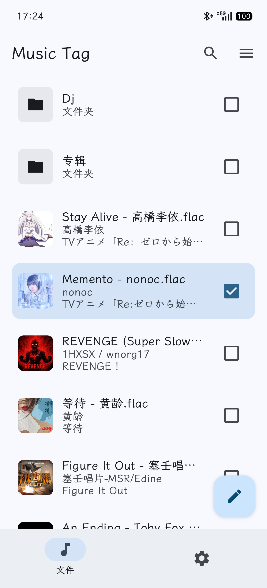
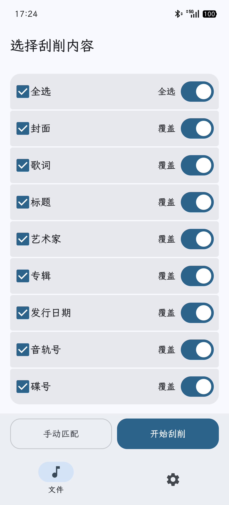
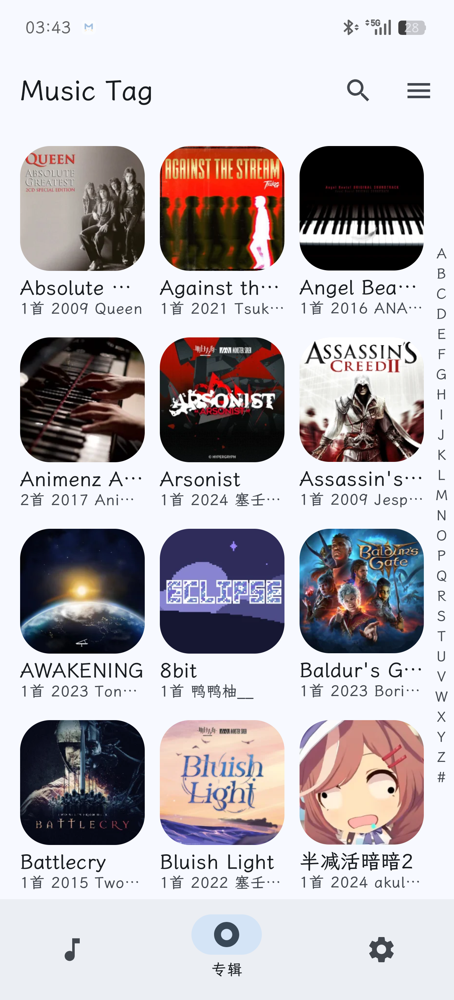

# Music Tag

Music Tag 是面向 Android 的本地音乐标签工具。从网络源匹配标签、封面与歌词并写入文件，也可按标签批量重命名。

  
  
  

## Feature

- 搜索覆盖音频的文件名，以及标题、艺术家、专辑、专辑艺术家、注释和日期等标签。
- 单曲或批量手动编辑标题、艺术家、专辑、日期、编号、歌词和封面
- 支持 FLAC、MP3 和标准 WAV
- Material 3 界面
